# Вольт — интернет-магазин электроники на Laravel с оплатой через ЮKassa

Интернет-магазин компьютеров, ноутбуков и смартфонов. Сделан без WordPress: каталог с фильтрами, корзина для гостя и покупателя, оформление с резервом товара, онлайн-оплата через ЮKassa с обработкой уведомлений (webhook), личный кабинет и админка на Filament.

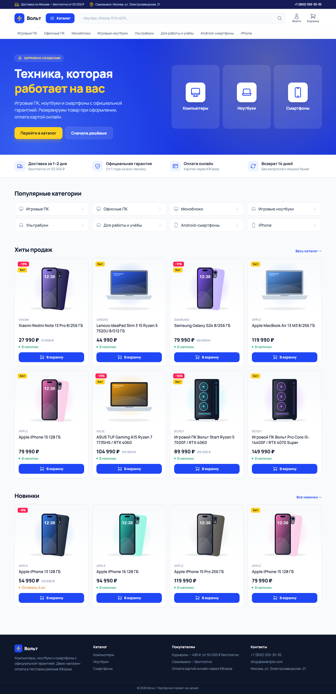

## Возможности

**Витрина (Livewire + Tailwind)**
- Каталог с двумя уровнями категорий. Родительская категория показывает товары всех подкатегорий.
- Поиск по названию, артикулу и бренду.
- Фильтры по бренду, цене, наличию и характеристикам: процессор, память, накопитель, видеокарта, экран, ОС, цвет. В фильтре показываются только значения, которые есть у товаров в текущей выдаче. Все фильтры хранятся в адресе, так что ссылкой на подборку можно поделиться.
- Сортировка: популярные, дешевле, дороже, новинки. Товары, которых нет в наличии, всегда стоят в конце списка.
- Карточка товара: галерея, старая цена и скидка, остаток («осталось 2 шт.»), характеристики, похожие товары.
- Корзина есть и у гостя (cookie), и у покупателя с аккаунтом. При входе гостевая корзина переносится в аккаунт.
- Оформление заказа без регистрации. Доставка курьером или самовывоз, курьер бесплатно от 50 000 ₽.
- Страница заказа по секретной ссылке: статус, оплата, ожидание подтверждения от ЮKassa.
- Личный кабинет: история заказов и профиль.
- Письма покупателю через очередь: заказ оформлен, оплата получена, смена статуса, отмена.

**Админка (Filament 5)**
- Инфопанель: выручка за день и за 30 дней, средний чек, заказы к сборке, товары, которые заканчиваются, график выручки, последние заказы.
- Заказы: вкладки по статусам, поиск по номеру, имени, телефону и email. Смена статуса («Собирается» → «Передан в доставку» → «Выполнен») и отмена с возвратом товара на склад. Покупатель получает письмо о каждой смене.
- Платежи заказа: id в ЮKassa, статус, причина отказа.
- Товары: цена вводится в рублях, в базе хранится в копейках. Фото, характеристики, быстрая правка остатка прямо из списка, фильтр «Заканчиваются».
- Категории, бренды, характеристики (для каждой можно включить показ в фильтрах).
- Колокольчик: «Оплачен заказ №…», «Повторная оплата — нужен возврат».

## Стек

Laravel 13, PHP 8.4, Livewire 4, Tailwind CSS 4, Alpine.js, Filament 5, MySQL 8, Pest 5. Очереди на драйвере `database`, API ЮKassa v3.

## Как устроена оплата

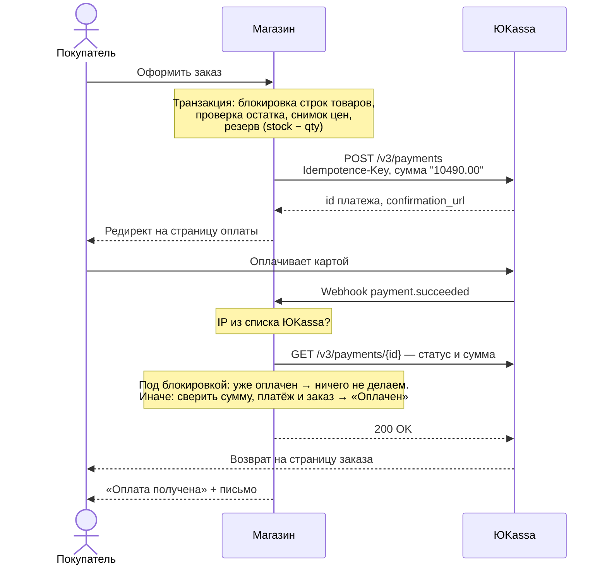

### Главные решения

1. **Деньги только в копейках (целые числа).** В рубли с дробной частью они превращаются только на границах: при выводе и в запросе к ЮKassa. Перевод `149050 ↔ "1490.50"` сделан без float, на целочисленной арифметике ([app/Support/Money.php](app/Support/Money.php)).

2. **Резерв при оформлении.** [PlaceOrder](app/Actions/PlaceOrder.php) в одной транзакции блокирует строки товаров (`lockForUpdate`, по возрастанию id, чтобы не было взаимных блокировок), проверяет остаток и уменьшает его. Если двое одновременно берут последний ноутбук, второй получит отказ, а не оплатит товар, которого нет. Цена и название фиксируются в позиции заказа, поэтому поздняя правка товара заказ не меняет.

3. **Телу webhook не доверяем.** ЮKassa не подписывает уведомления, поэтому защита двойная:
   - принимаем запросы только с IP-адресов ЮKassa ([VerifyYooKassaIp](app/Http/Middleware/VerifyYooKassaIp.php));
   - статус и сумму всегда перечитываем запросом `GET /v3/payments/{id}`. Поддельный «payment.succeeded» ничего не изменит.

4. **Идемпотентная обработка.** [PaymentService::sync()](app/Services/Payments/PaymentService.php) — единственное место, где заказ становится оплаченным. Строка платежа блокируется. Если платёж уже в итоговом статусе, повторное уведомление ничего не меняет: письма не дублируются, `paid_at` не перезаписывается. Тесты проверяют это, в том числе мутационно: если убрать защиту, тест падает.

5. **Idempotence-Key при создании платежа.** Если запрос к ЮKassa оборвался или покупатель дважды нажал «Оплатить», повтор уходит с тем же ключом, и ЮKassa возвращает тот же платёж, а не создаёт второй.

6. **Ответы webhook.** Если платёж обработан или неизвестен, отвечаем `200`. Если API ЮKassa недоступно, отвечаем `500`, и ЮKassa повторит уведомление позже.

7. **Истёкший резерв.** Команда `shop:expire-orders` запускается каждые 5 минут. Она отменяет неоплаченные заказы старше `SHOP_PAYMENT_TTL` минут и возвращает товар на склад. Перед отменой сверяется с ЮKassa: вдруг покупатель заплатил, а уведомление потерялось.

8. **Пограничные случаи:**
   - Оплата пришла после отмены по таймауту. Если товар ещё есть, заказ восстанавливается. Если нет, админ получает сигнал «нужен возврат».
   - Второй платёж по уже оплаченному заказу: сигнал админу о возврате лишнего платежа.
   - Сумма в ЮKassa не совпала с заказом: заказ не оплачивается, админ получает предупреждение.

9. **Страница возврата не доказывает оплату.** После возврата покупателя из ЮKassa магазин сам запрашивает статус платежа, а страница заказа несколько секунд опрашивает его. Поэтому оплата подтверждается и локально, без публичного webhook.

### Демо-режим оплаты

Пока магазин не подключён к ЮKassa, на демо-стенде включён `YOOKASSA_DEMO=true`. Вместо API ЮKassa работает эмулятор [DemoYooKassaClient](app/Services/YooKassa/DemoYooKassaClient.php): он создаёт платёж, соблюдает `Idempotence-Key` и отдаёт ссылку на страницу «Тестовая оплата» внутри магазина с кнопками «Оплатить» и «Отклонить». Всё остальное работает без изменений: возврат покупателя, проверка статуса, идемпотентный `sync()`, письма, отмена по таймауту. Деньги не списываются. Чтобы перейти на настоящую ЮKassa, впишите ключи в `.env` и выключите `YOOKASSA_DEMO`, код менять не нужно.

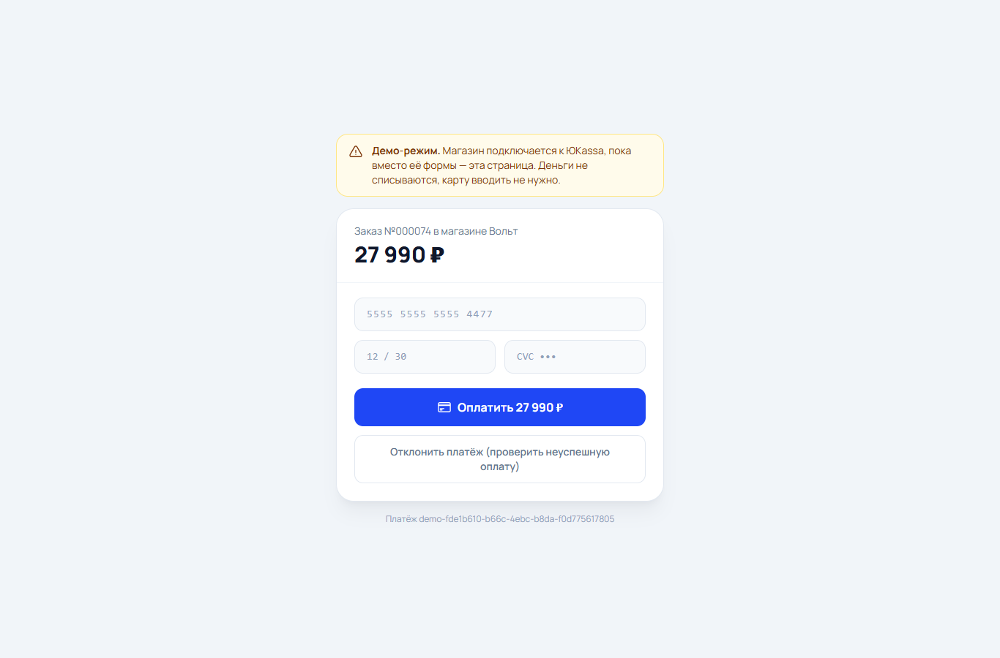

## Скриншоты

| Каталог и фильтры | Карточка товара |
|---|---|
| 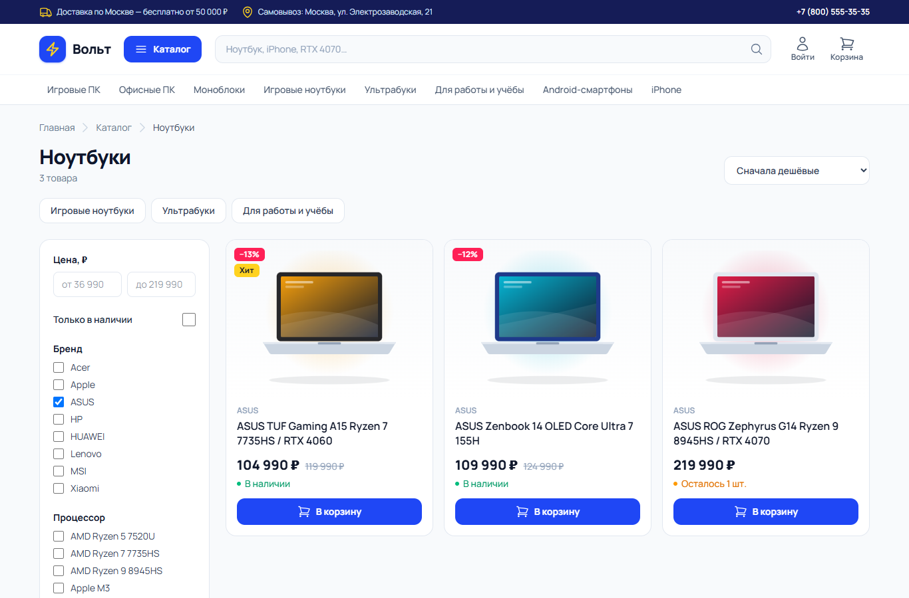 | 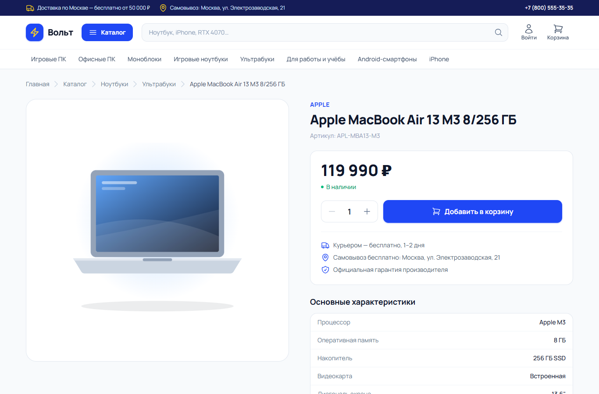 |

| Корзина | Оформление |
|---|---|
| 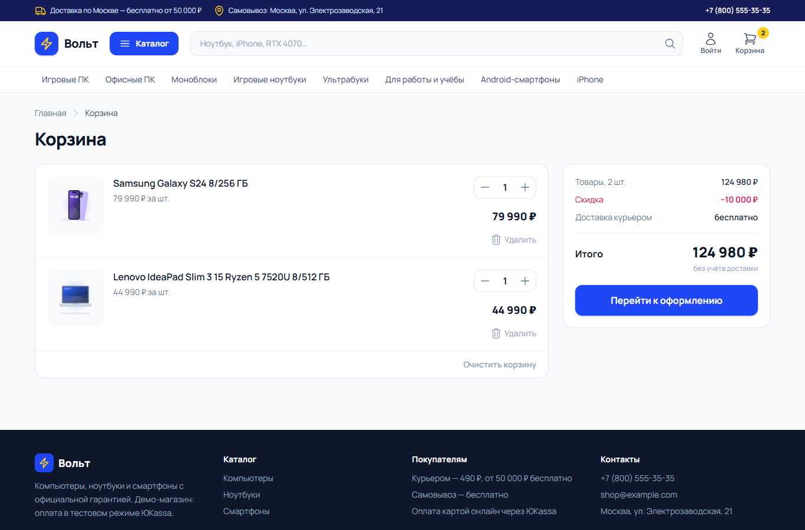 | 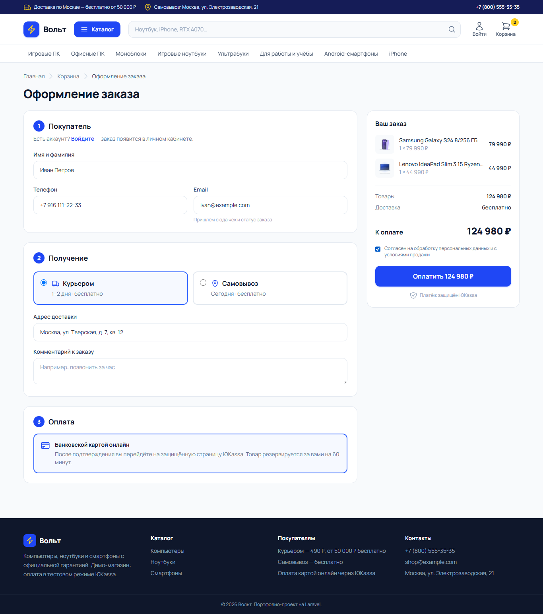 |

| Заказ оплачен | Мобильная версия |
|---|---|
| 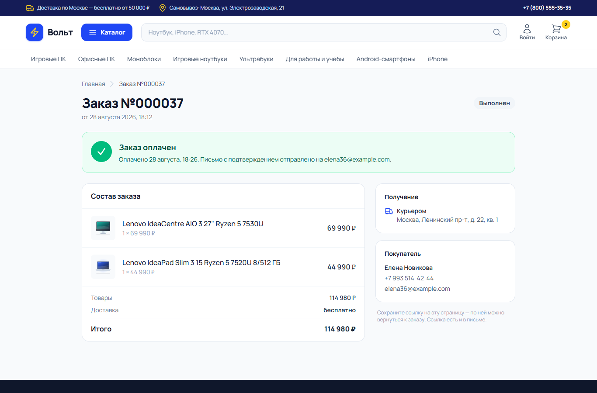 | 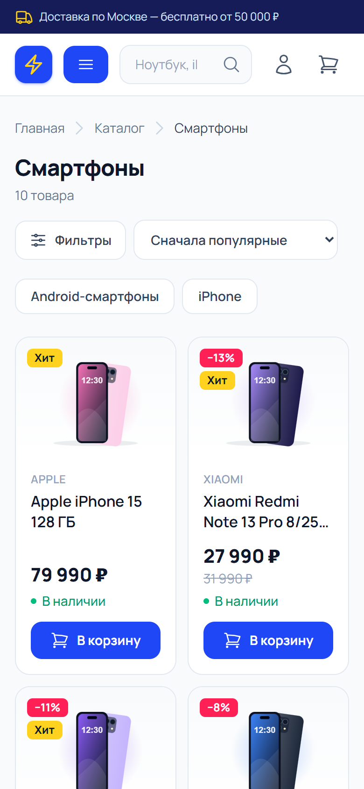 |

| Админка: инфопанель | Админка: заказ и платежи |
|---|---|
| 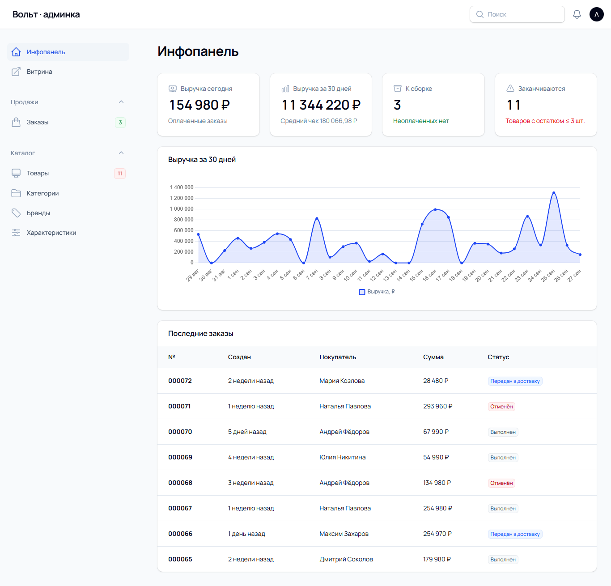 | 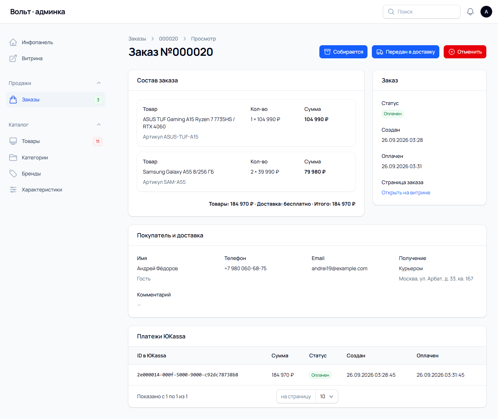 |

## Запуск локально

```bash
git clone <репозиторий> online-shop && cd online-shop
composer install
cp .env.example .env
php artisan key:generate
# в .env: DB_* (MySQL), APP_URL
php artisan migrate --seed      # демо-каталог из 36 товаров и история заказов за 30 дней
php artisan storage:link
npm install && npm run build
php artisan serve
```

Очередь писем и отмена просроченных заказов:

```bash
php artisan queue:work
php artisan schedule:work
```

**Демо-доступ.** Админка `/admin`: `admin@example.com` / `password`. При `SHOP_DEMO=true` форма входа заполняется сама. Покупатель: `buyer@example.com` / `password`.

### Подключение тестовой ЮKassa

1. Зарегистрируйтесь в [ЮKassa](https://yookassa.ru) и создайте **тестовый магазин**.
2. «Интеграция → Ключи API»: `shopId` и секретный ключ пропишите в `.env`:
   ```
   YOOKASSA_SHOP_ID=...
   YOOKASSA_SECRET_KEY=test_...
   ```
3. «Интеграция → HTTP-уведомления»: укажите `https://<ваш-домен>/payments/yookassa/webhook` и отметьте события `payment.succeeded` и `payment.canceled`. Нужен HTTPS. Локально подойдёт `cloudflared tunnel --url http://localhost:8000`. Если сайт стоит за прокси (например, Cloudflare Worker), поставьте `YOOKASSA_VERIFY_IP=false`: статус всё равно перепроверяется через API.
4. Оплатите заказ тестовой картой `5555 5555 5555 4477`: срок — любая будущая дата, CVC — любой.

Чек по 54-ФЗ включается флагом `YOOKASSA_RECEIPT=true`, ставка НДС задаётся в `YOOKASSA_VAT_CODE`.

### Настройки магазина (`.env`)

| Переменная | Что задаёт |
|---|---|
| `SHOP_PAYMENT_TTL` | Сколько минут держать резерв за неоплаченным заказом (по умолчанию 60) |
| `SHOP_COURIER_PRICE` | Стоимость курьерской доставки, копейки |
| `SHOP_FREE_DELIVERY_FROM` | С какой суммы доставка бесплатная, копейки |
| `SHOP_SCHEDULED_QUEUE_WORKER` | Разбирать очередь через cron (для виртуального хостинга без постоянных процессов) |
| `SHOP_DEMO` | Демо-режим: подсказки с доступами |
| `YOOKASSA_DEMO` | Демо-оплата вместо ЮKassa (страница «Тестовая оплата», деньги не списываются) |
| `YOOKASSA_VERIFY_IP` | Принимать webhook только с IP ЮKassa (за прокси выключить) |

## Тесты

```bash
php artisan test
```

110 тестов на Pest. Проходят на SQLite и на MySQL:

- **Корзина:** гостевая корзина по cookie, перенос в аккаунт при входе с суммированием количеств, ограничение остатком, товар закончился, пока лежал в корзине.
- **Расчёт суммы:** позиции, доставка до порога и ровно на пороге, самовывоз, экономия, товары без наличия не идут в сумму; деньги без float.
- **Оформление:** резерв, снимок цены, «последний товар не продаётся дважды», откат при нехватке, ЮKassa недоступна.
- **Создание платежа:** сумма строкой, Basic-авторизация, `Idempotence-Key`, повтор после сбоя с тем же ключом, повторное использование живого платежа, новый платёж вместо отменённого, чек 54-ФЗ сходится с суммой.
- **Webhook:** успешная оплата, повторное уведомление ничего не меняет, телу не верим, отмена, несовпадение суммы, неизвестный платёж, чужой IP, недоступное API → 500, без CSRF, оплата после отмены по таймауту, двойная оплата.
- **Демо-оплата:** полный путь через эмулятор без единого запроса во внешнее API, отказ и повторная попытка, идемпотентность.
- **Отмена по таймауту**, страница заказа, кабинет, каталог и фильтры, админка, демо-сидер.

## Структура

```
app/
├── Actions/            PlaceOrder, CancelOrder, ChangeOrderStatus — сценарии заказа
├── Services/
│   ├── Cart/           CartService, CartSummary — корзина и расчёт
│   ├── Payments/       PaymentService — платёжный поток и идемпотентность
│   └── YooKassa/       YooKassaClient — клиент API на Http, DemoYooKassaClient — эмулятор
├── Http/Controllers/   YooKassaWebhookController, PaymentReturnController, …
├── Livewire/           Catalog, CartPage, Checkout, OrderPage, AddToCart, CartCounter
├── Filament/           Ресурсы админки и виджеты дашборда
├── Console/Commands/   ExpireUnpaidOrders
└── Enums/              OrderStatus, PaymentStatus, DeliveryMethod
```
